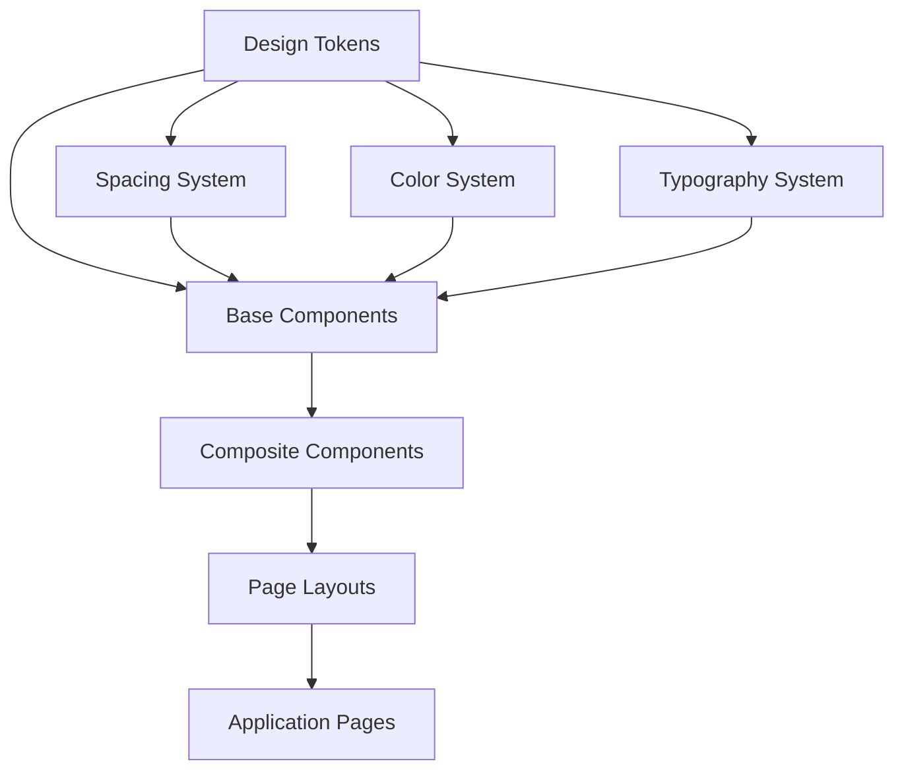

# UI/UX Enhancement Design Document

## Overview

This design document outlines the comprehensive UI/UX enhancement strategy for the Leave Management System. The enhancement will establish a professional, consistent design system using shadcn/ui components, implement proportional spacing standards, refine the color system, and improve the overall user experience across all pages and components.

The system already has a solid foundation with Tailwind CSS, CSS variables for theming, and some shadcn/ui components. This enhancement will build upon that foundation to create a more polished and professional interface.

## Architecture

### Design System Layers



### Component Hierarchy

1. **Design Tokens Layer**: CSS variables and Tailwind configuration
2. **Base Components Layer**: shadcn/ui primitives (Button, Input, Card, etc.)
3. **Composite Components Layer**: Feature-specific components built from base components
4. **Layout Layer**: Page layouts and containers
5. **Page Layer**: Complete pages using all layers

## Components and Interfaces

### 1. Spacing System

#### Spacing Scale
We'll implement a consistent 8-point spacing system:

```typescript
// Spacing scale (in pixels)
const spacing = {
  0: '0px',      // 0
  1: '4px',      // 0.25rem
  2: '8px',      // 0.5rem
  3: '12px',     // 0.75rem
  4: '16px',     // 1rem
  5: '20px',     // 1.25rem
  6: '24px',     // 1.5rem
  8: '32px',     // 2rem
  10: '40px',    // 2.5rem
  12: '48px',    // 3rem
  16: '64px',    // 4rem
  20: '80px',    // 5rem
  24: '96px',    // 6rem
}
```

#### Spacing Guidelines
- **Micro spacing (4-8px)**: Between related elements (icon and text, form label and input)
- **Small spacing (12-16px)**: Between form fields, list items
- **Medium spacing (24-32px)**: Between sections within a card, card padding
- **Large spacing (48-64px)**: Between major page sections, page margins

#### Container Standards
```typescript
// Container configurations
const containers = {
  page: {
    maxWidth: '1280px',
    padding: { mobile: '16px', tablet: '24px', desktop: '32px' }
  },
  card: {
    padding: { mobile: '16px', tablet: '20px', desktop: '24px' }
  },
  section: {
    gap: { mobile: '24px', tablet: '32px', desktop: '48px' }
  }
}
```

### 2. Enhanced Color System

#### Semantic Color Tokens
The existing color system is already well-structured. We'll enhance it with additional utility classes:

```css
/* Status colors - already defined */
--success: 142.1 76.2% 36.3%;
--warning: 48 96% 53%;
--destructive: 0 84.2% 60.2%;

/* Additional semantic colors */
--info: 217.2 91.2% 59.8%;
--info-foreground: 222.2 47.4% 11.2%;
--info-subtle: 217.2 91.2% 95%;
--info-strong: 217.2 91.2% 40%;
```

#### Color Usage Guidelines
- **Primary**: Main actions, links, active states
- **Secondary**: Secondary actions, less prominent elements
- **Success**: Approved leaves, successful operations
- **Warning**: Pending approvals, caution states
- **Destructive**: Rejected leaves, delete actions, errors
- **Info**: Informational messages, neutral status
- **Muted**: Disabled states, placeholder text, subtle backgrounds

### 3. Typography System

#### Type Scale
```typescript
const typography = {
  // Display (for hero sections, rarely used)
  display: {
    size: '3.75rem',      // 60px
    lineHeight: '1.1',
    weight: '700',
    letterSpacing: '-0.02em'
  },
  
  // Headings
  h1: {
    size: '2.25rem',      // 36px
    lineHeight: '1.2',
    weight: '700',
    letterSpacing: '-0.01em'
  },
  h2: {
    size: '1.875rem',     // 30px
    lineHeight: '1.3',
    weight: '600',
    letterSpacing: '-0.01em'
  },
  h3: {
    size: '1.5rem',       // 24px
    lineHeight: '1.4',
    weight: '600'
  },
  h4: {
    size: '1.25rem',      // 20px
    lineHeight: '1.5',
    weight: '600'
  },
  h5: {
    size: '1.125rem',     // 18px
    lineHeight: '1.5',
    weight: '600'
  },
  h6: {
    size: '1rem',         // 16px
    lineHeight: '1.5',
    weight: '600'
  },
  
  // Body text
  body: {
    large: {
      size: '1.125rem',   // 18px
      lineHeight: '1.6',
      weight: '400'
    },
    base: {
      size: '1rem',       // 16px
      lineHeight: '1.6',
      weight: '400'
    },
    small: {
      size: '0.875rem',   // 14px
      lineHeight: '1.5',
      weight: '400'
    },
    xs: {
      size: '0.75rem',    // 12px
      lineHeight: '1.4',
      weight: '400'
    }
  },
  
  // Special
  label: {
    size: '0.875rem',     // 14px
    lineHeight: '1.5',
    weight: '500'
  },
  caption: {
    size: '0.75rem',      // 12px
    lineHeight: '1.4',
    weight: '400'
  }
}
```

### 4. shadcn/ui Component Integration

#### Components to Add
Based on the existing UI directory, we need to add these shadcn components:

1. **Table** - For leave request lists, admin views
2. **Dialog** - For modals and confirmations
3. **Form** - For structured form handling with validation
4. **Textarea** - For leave reason inputs
5. **Checkbox** - For multi-select options
6. **Radio Group** - For leave type selection
7. **Tabs** - For dashboard sections
8. **Alert** - For notifications and messages
9. **Progress** - For leave balance indicators
10. **Skeleton** - For loading states
11. **Sheet** - For mobile navigation
12. **Popover** - For additional information
13. **Command** - For search functionality
14. **Scroll Area** - For scrollable content

#### Component Configuration
Each shadcn component will be configured with:
- Consistent variant styles matching the design system
- Proper TypeScript types
- Accessibility attributes (ARIA labels, roles)
- Responsive behavior
- Dark mode support

### 5. Page Layout Structure

#### Standard Page Layout
```typescript
interface PageLayout {
  container: {
    maxWidth: '1280px',
    padding: 'responsive',
    margin: 'auto'
  },
  header: {
    height: '64px',
    padding: '16px 24px',
    borderBottom: '1px solid border'
  },
  content: {
    padding: { mobile: '16px', desktop: '32px' },
    gap: '24px'
  },
  sidebar: {
    width: { collapsed: '64px', expanded: '240px' },
    transition: 'width 0.3s ease'
  }
}
```

#### Dashboard Layout Enhancement
```
┌─────────────────────────────────────────┐
│  Header (64px)                          │
│  [Logo] [Nav] [User Menu] [Theme]       │
├──────┬──────────────────────────────────┤
│      │                                  │
│ Side │  Content Area                    │
│ bar  │  ┌────────────────────────────┐  │
│      │  │  Page Header               │  │
│ 240  │  │  Title + Actions           │  │
│ px   │  └────────────────────────────┘  │
│      │                                  │
│      │  ┌────────────────────────────┐  │
│      │  │  Main Content              │  │
│      │  │  Cards, Tables, Forms      │  │
│      │  └────────────────────────────┘  │
│      │                                  │
└──────┴──────────────────────────────────┘
```

### 6. Component Enhancement Specifications

#### Card Component Enhancement
```typescript
interface EnhancedCard {
  variants: {
    default: 'Standard card with border',
    elevated: 'Card with shadow, no border',
    outlined: 'Card with prominent border',
    ghost: 'Transparent card, visible on hover'
  },
  padding: {
    compact: '16px',
    default: '24px',
    spacious: '32px'
  },
  hover: {
    enabled: boolean,
    effect: 'lift' | 'glow' | 'border'
  }
}
```

#### Button Component Enhancement
```typescript
interface EnhancedButton {
  variants: {
    default: 'Primary action button',
    secondary: 'Secondary action button',
    outline: 'Outlined button',
    ghost: 'Transparent button',
    link: 'Link-styled button',
    destructive: 'Destructive action button'
  },
  sizes: {
    sm: 'height: 32px, padding: 8px 12px',
    default: 'height: 40px, padding: 12px 16px',
    lg: 'height: 48px, padding: 16px 24px',
    icon: 'square button for icons'
  },
  states: {
    hover: 'Subtle background change',
    active: 'Pressed state',
    disabled: 'Reduced opacity, no interaction',
    loading: 'Spinner + disabled state'
  }
}
```

#### Form Component Enhancement
```typescript
interface EnhancedForm {
  layout: {
    vertical: 'Stacked labels and inputs',
    horizontal: 'Side-by-side labels and inputs',
    inline: 'Compact inline form'
  },
  spacing: {
    fieldGap: '16px',
    labelGap: '8px',
    sectionGap: '32px'
  },
  validation: {
    inline: 'Show errors below field',
    summary: 'Show all errors at top',
    toast: 'Show errors in toast notification'
  }
}
```

#### Table Component Enhancement
```typescript
interface EnhancedTable {
  variants: {
    default: 'Standard table',
    striped: 'Alternating row colors',
    bordered: 'Full borders',
    hoverable: 'Row hover effect'
  },
  density: {
    compact: 'padding: 8px',
    default: 'padding: 12px',
    comfortable: 'padding: 16px'
  },
  features: {
    sorting: boolean,
    filtering: boolean,
    pagination: boolean,
    selection: boolean
  }
}
```

## Data Models

### Theme Configuration
```typescript
interface ThemeConfig {
  colors: {
    light: ColorPalette,
    dark: ColorPalette
  },
  spacing: SpacingScale,
  typography: TypographyScale,
  borderRadius: BorderRadiusScale,
  shadows: ShadowScale,
  transitions: TransitionConfig
}

interface ColorPalette {
  primary: string,
  secondary: string,
  success: string,
  warning: string,
  destructive: string,
  info: string,
  background: string,
  foreground: string,
  muted: string,
  accent: string,
  border: string,
  input: string,
  ring: string
}
```

### Component Props Standards
```typescript
// Standard props for all enhanced components
interface BaseComponentProps {
  className?: string,
  variant?: string,
  size?: 'sm' | 'default' | 'lg',
  disabled?: boolean,
  'aria-label'?: string,
  'data-testid'?: string
}

// Spacing props for layout components
interface SpacingProps {
  p?: number,  // padding
  px?: number, // padding horizontal
  py?: number, // padding vertical
  m?: number,  // margin
  mx?: number, // margin horizontal
  my?: number, // margin vertical
  gap?: number // gap for flex/grid
}
```

## Error Handling

### Visual Error States

1. **Form Validation Errors**
   - Display inline below field
   - Red border on invalid field
   - Error icon next to message
   - Accessible error announcement

2. **API Errors**
   - Toast notification for transient errors
   - Alert component for persistent errors
   - Retry button when applicable
   - Clear error message text

3. **Loading States**
   - Skeleton loaders for content
   - Spinner for actions
   - Disabled state for forms
   - Progress indicator for multi-step processes

4. **Empty States**
   - Illustration or icon
   - Descriptive message
   - Call-to-action button
   - Helpful suggestions

## Testing Strategy

### Visual Regression Testing
- Capture screenshots of all major components
- Test in both light and dark modes
- Test at multiple viewport sizes
- Compare against baseline images

### Accessibility Testing
- Automated tests with axe-core
- Keyboard navigation testing
- Screen reader testing
- Color contrast validation
- Focus indicator verification

### Component Testing
- Unit tests for all new components
- Test all variants and sizes
- Test interactive states
- Test with different prop combinations

### Integration Testing
- Test complete page layouts
- Test theme switching
- Test responsive behavior
- Test form submissions with validation

### Manual Testing Checklist
- [ ] All pages render correctly in light mode
- [ ] All pages render correctly in dark mode
- [ ] Spacing is consistent across pages
- [ ] Typography hierarchy is clear
- [ ] Interactive elements have proper hover/focus states
- [ ] Forms validate correctly
- [ ] Error states display properly
- [ ] Loading states work smoothly
- [ ] Mobile responsive design works
- [ ] Tablet responsive design works
- [ ] Desktop layout is optimal
- [ ] Theme toggle works correctly
- [ ] All colors meet WCAG AA contrast requirements

## Implementation Phases

### Phase 1: Foundation
- Update Tailwind configuration with spacing scale
- Add missing CSS variables for info colors
- Create typography utility classes
- Set up component testing infrastructure

### Phase 2: Core Components
- Install and configure missing shadcn components
- Enhance existing components with new variants
- Create composite components (StatCard, LeaveCard, etc.)
- Update button and input components

### Phase 3: Layout Enhancement
- Update DashboardLayout with improved spacing
- Enhance navigation components
- Improve header and sidebar
- Create responsive container components

### Phase 4: Page Enhancement
- Update dashboard pages with new components
- Enhance form pages with Form component
- Update table views with Table component
- Improve admin pages

### Phase 5: Polish & Testing
- Add loading states and skeletons
- Implement empty states
- Add micro-interactions and animations
- Comprehensive testing and bug fixes

## Design Decisions and Rationales

### Why shadcn/ui?
- **Customizable**: Components are copied into the project, allowing full customization
- **Accessible**: Built on Radix UI primitives with excellent accessibility
- **Type-safe**: Full TypeScript support
- **Unstyled base**: Uses Tailwind CSS, matching our existing setup
- **No runtime overhead**: Components are part of the codebase, not a dependency

### Why 8-point spacing system?
- **Mathematical consistency**: All spacing values are multiples of 8
- **Designer-developer alignment**: Common standard in design tools
- **Responsive scaling**: Easy to scale proportionally
- **Visual rhythm**: Creates consistent visual patterns

### Why CSS variables for colors?
- **Theme switching**: Easy to switch between light and dark modes
- **Maintainability**: Change colors in one place
- **Performance**: No JavaScript required for theming
- **Flexibility**: Can be overridden at component level

### Why semantic color naming?
- **Intent-based**: Colors represent meaning, not appearance
- **Consistency**: Same meaning = same color across the app
- **Maintainability**: Can change the actual color without changing usage
- **Accessibility**: Easier to ensure proper contrast for each semantic use

## Responsive Design Strategy

### Breakpoints
```typescript
const breakpoints = {
  sm: '640px',   // Mobile landscape
  md: '768px',   // Tablet
  lg: '1024px',  // Desktop
  xl: '1280px',  // Large desktop
  '2xl': '1536px' // Extra large desktop
}
```

### Mobile-First Approach
- Design for mobile first, enhance for larger screens
- Use responsive spacing (smaller on mobile, larger on desktop)
- Stack layouts vertically on mobile, use columns on desktop
- Simplify navigation on mobile (hamburger menu)
- Reduce content density on mobile

### Responsive Patterns
- **Navigation**: Sidebar on desktop, bottom nav or drawer on mobile
- **Tables**: Horizontal scroll or card view on mobile
- **Forms**: Single column on mobile, multi-column on desktop
- **Cards**: Grid layout that adapts to screen size
- **Modals**: Full screen on mobile, centered on desktop

## Accessibility Compliance

### WCAG 2.1 AA Requirements
- **Color Contrast**: Minimum 4.5:1 for normal text, 3:1 for large text
- **Keyboard Navigation**: All interactive elements accessible via keyboard
- **Focus Indicators**: Visible focus indicators on all interactive elements
- **Screen Reader Support**: Proper ARIA labels and semantic HTML
- **Form Labels**: All form inputs have associated labels
- **Error Identification**: Errors clearly identified and described
- **Consistent Navigation**: Navigation is consistent across pages

### Implementation Guidelines
- Use semantic HTML elements
- Provide alt text for images
- Use ARIA labels for icon-only buttons
- Ensure proper heading hierarchy
- Provide skip links for keyboard users
- Test with screen readers (NVDA, JAWS, VoiceOver)
- Use focus-visible for keyboard-only focus indicators

## Performance Considerations

### Optimization Strategies
- **Code Splitting**: Load components only when needed
- **Tree Shaking**: Remove unused component code
- **CSS Optimization**: Purge unused Tailwind classes
- **Image Optimization**: Use Next.js Image component
- **Font Loading**: Optimize web font loading
- **Animation Performance**: Use CSS transforms and opacity for animations

### Bundle Size Management
- Monitor component bundle sizes
- Lazy load heavy components
- Use dynamic imports for modals and dialogs
- Minimize third-party dependencies

## Migration Strategy

### Backward Compatibility
- Maintain existing component APIs where possible
- Provide migration guides for breaking changes
- Support both old and new components during transition
- Gradual rollout page by page

### Rollout Plan
1. **Week 1**: Foundation and core components
2. **Week 2**: Layout enhancements
3. **Week 3**: Dashboard and main pages
4. **Week 4**: Admin pages and forms
5. **Week 5**: Polish, testing, and bug fixes

### Risk Mitigation
- Feature flags for new UI components
- A/B testing for major changes
- User feedback collection
- Rollback plan if issues arise
