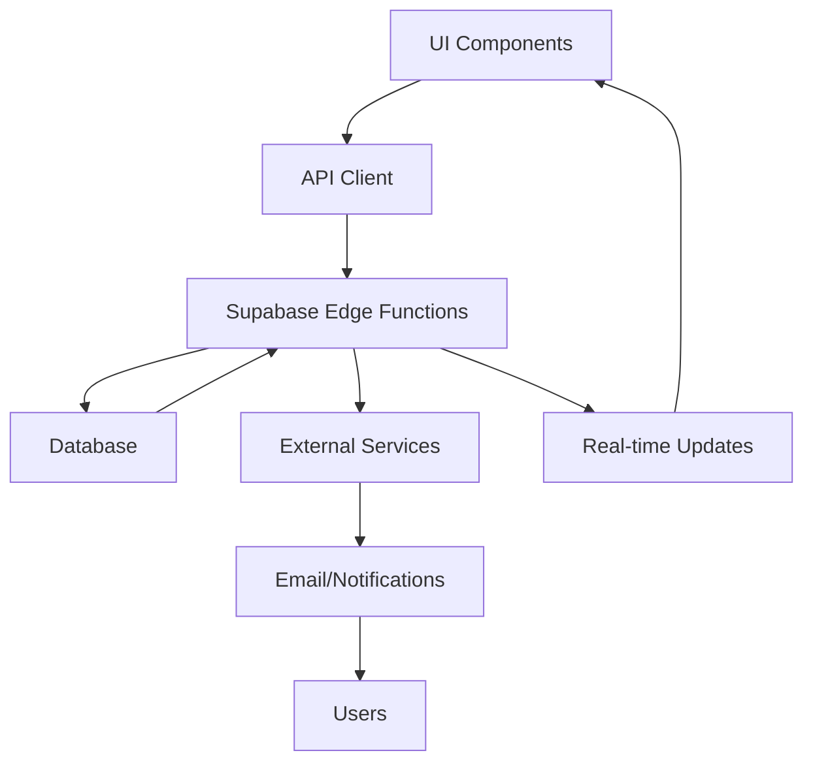
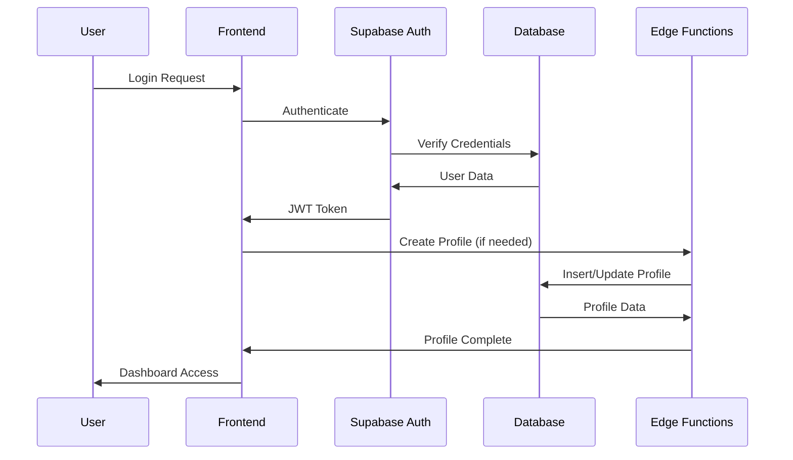

# Leave Management System - Integration Architecture

## Cross-System Integration Patterns

This document outlines how UI components, API endpoints, and data flows integrate across the Leave Management System to ensure consistency, performance, and maintainability.

## 1. Data Flow Architecture

### 1.1 Core Data Flows



### 1.2 Authentication Flow Integration



## 2. Component-API Integration

### 2.1 Leave Request Integration

#### UI Components → API Integration
```typescript
// LeaveRequestForm component integration
const LeaveRequestForm = () => {
  const { data: leaveTypes } = useQuery({
    queryKey: ['leave-types'],
    queryFn: () => api.getLeaveTypes()
  });

  const createMutation = useMutation({
    mutationFn: (data: LeaveRequestData) => api.createLeaveRequest(data),
    onSuccess: () => {
      // Real-time update triggers
      queryClient.invalidateQueries({ queryKey: ['leaves'] });
      toast.success('Leave request submitted');
    }
  });

  // Component renders with real-time data
  return (
    <Form onSubmit={createMutation.mutate}>
      <LeaveTypeSelect options={leaveTypes} />
      <DateRangePicker />
      <SubmitButton loading={createMutation.isPending} />
    </Form>
  );
};
```

#### API → Database Integration
```typescript
// Edge function handling leave creation
export async function createLeaveRequest(data: LeaveRequestData) {
  // 1. Validate business rules
  await validateLeaveBalance(data.userId, data.leaveTypeId, data.daysCount);

  // 2. Calculate exact leave days
  const daysCount = calculateBusinessDays(data.startDate, data.endDate);

  // 3. Create database record with transaction
  const leave = await supabase.rpc('create_leave_request', {
    p_requester_id: data.userId,
    p_leave_type_id: data.leaveTypeId,
    p_start_date: data.startDate,
    p_end_date: data.endDate,
    p_days_count: daysCount,
    p_reason: data.reason
  });

  // 4. Trigger notifications
  await notifyManagers(data.userId, leave);

  // 5. Update leave balance
  await updateLeaveBalance(data.userId, data.leaveTypeId, -daysCount);

  return leave;
}
```

### 2.2 Real-time Updates Integration

#### Supabase Real-time → Component Updates
```typescript
// Real-time subscription in React component
const useLeaveUpdates = (userId: string) => {
  return useSubscription({
    table: 'leaves',
    filter: `requester_id=eq.${userId}`,
    onUpdate: (payload) => {
      // Update local state
      queryClient.invalidateQueries({ queryKey: ['leaves', userId] });

      // Show toast notification
      if (payload.new.status !== payload.old?.status) {
        toast.info(`Leave request ${payload.new.status}`);
      }
    }
  });
};
```

## 3. State Management Integration

### 3.1 Global State Architecture

```typescript
// Zustand store for global state
interface AppState {
  // Authentication
  user: User | null;
  isAuthenticated: boolean;

  // UI State
  sidebarOpen: boolean;
  theme: 'light' | 'dark';

  // Real-time State
  notifications: Notification[];
  pendingApprovals: number;
}

// Store actions
const useAppStore = create<AppState>((set, get) => ({
  // Auth actions
  setUser: (user) => set({ user, isAuthenticated: !!user }),

  // UI actions
  toggleSidebar: () => set((state) => ({ sidebarOpen: !state.sidebarOpen })),

  // Real-time actions
  addNotification: (notification) =>
    set((state) => ({
      notifications: [...state.notifications, notification]
    })),

  updatePendingApprovals: (count) => set({ pendingApprovals: count })
}));
```

### 3.2 Component State Integration

```typescript
// Component using global and local state
const ApprovalQueue = () => {
  const { user } = useAppStore();
  const [filters, setFilters] = useState<LeaveFilters>({});

  const { data: approvals, isLoading } = useQuery({
    queryKey: ['approvals', user?.id, filters],
    queryFn: () => api.getPendingApprovals(user!.id, filters),
    enabled: !!user
  });

  // Update global pending count
  useEffect(() => {
    if (approvals) {
      useAppStore.getState().updatePendingApprovals(approvals.length);
    }
  }, [approvals]);

  return (
    <div>
      <ApprovalFilters filters={filters} onChange={setFilters} />
      <ApprovalList approvals={approvals} loading={isLoading} />
    </div>
  );
};
```

## 4. Error Handling Integration

### 4.1 Error Boundary Integration

```typescript
// Global error boundary
class AppErrorBoundary extends React.Component {
  constructor(props) {
    super(props);
    this.state = { hasError: false };
  }

  static getDerivedStateFromError(error) {
    // Update state to trigger fallback UI
    return { hasError: true };
  }

  componentDidCatch(error, errorInfo) {
    // Log to Sentry
    Sentry.captureException(error, { contexts: { errorInfo } });

    // Update global error state
    useAppStore.getState().setError({ error, errorInfo });
  }

  render() {
    if (this.state.hasError) {
      return <ErrorFallback />;
    }

    return this.props.children;
  }
}
```

### 4.2 API Error Integration

```typescript
// Centralized API error handling
const apiClient = {
  async request<T>(config: ApiConfig): Promise<T> {
    try {
      const response = await fetch(config.url, {
        method: config.method,
        headers: config.headers,
        body: config.body
      });

      if (!response.ok) {
        throw new ApiError(
          response.status,
          await response.text()
        );
      }

      return response.json();
    } catch (error) {
      // Log error
      Sentry.captureException(error);

      // Transform for UI
      const uiError = transformApiError(error);

      // Update global state
      useAppStore.getState().addError(uiError);

      throw uiError;
    }
  }
};
```

## 5. Performance Integration

### 5.1 Caching Integration

```typescript
// React Query configuration with Supabase integration
const queryClient = new QueryClient({
  defaultOptions: {
    queries: {
      // Cache for 5 minutes
      staleTime: 5 * 60 * 1000,

      // Background refetch
      refetchOnWindowFocus: false,

      // Retry failed requests
      retry: (failureCount, error) => {
        // Don't retry auth errors
        if (error instanceof ApiError && error.status === 401) {
          return false;
        }
        return failureCount < 3;
      }
    },

    mutations: {
      // Optimistic updates for better UX
      onMutate: async (variables) => {
        // Cancel outgoing refetches
        await queryClient.cancelQueries({ queryKey: ['leaves'] });

        // Snapshot previous value
        const previousLeaves = queryClient.getQueryData(['leaves']);

        // Optimistically update
        queryClient.setQueryData(['leaves'], (old: any) => [...old, variables]);

        return { previousLeaves };
      },

      onError: (err, variables, context) => {
        // Rollback on error
        if (context?.previousLeaves) {
          queryClient.setQueryData(['leaves'], context.previousLeaves);
        }
      }
    }
  }
});
```

### 5.2 Image Optimization Integration

```typescript
// Next.js image optimization with Supabase Storage
const OptimizedImage = ({ src, alt, ...props }) => {
  const [imageSrc, setImageSrc] = useState(src);

  return (
    <Image
      {...props}
      src={imageSrc}
      alt={alt}
      onError={() => setImageSrc('/fallback-avatar.png')}
      placeholder="blur"
      blurDataURL="data:image/jpeg;base64,..."
      sizes="(max-width: 768px) 100vw, (max-width: 1200px) 50vw, 33vw"
    />
  );
};

// Usage in components
<OptimizedImage
  src={user.photo_url}
  alt={`${user.full_name} profile`}
  width={40}
  height={40}
  className="rounded-full"
/>
```

## 6. External Service Integration

### 6.1 Email Service Integration

```typescript
// Email service abstraction
export class EmailService {
  private providers: EmailProvider[] = [
    new SendGridProvider(),
    new MailgunProvider()
  ];

  async sendEmail(emailData: EmailData): Promise<void> {
    for (const provider of this.providers) {
      try {
        await provider.send(emailData);
        return; // Success, exit early
      } catch (error) {
        console.error(`Provider ${provider.name} failed:`, error);
        // Try next provider
      }
    }

    // All providers failed
    throw new Error('All email providers failed');
  }
}

// Edge function integration
export async function sendLeaveNotification(leaveId: string) {
  const leave = await getLeaveWithDetails(leaveId);
  const emailService = new EmailService();

  await emailService.sendEmail({
    to: leave.requester.email,
    template: 'leave-status-update',
    data: {
      employeeName: leave.requester.full_name,
      status: leave.status,
      leaveType: leave.leave_type.name,
      dates: `${leave.start_date} to ${leave.end_date}`
    }
  });
}
```

### 6.2 Monitoring Integration

```typescript
// Sentry integration for error tracking
const initSentry = () => {
  Sentry.init({
    dsn: process.env.NEXT_PUBLIC_SENTRY_DSN,
    environment: process.env.NODE_ENV,
    tracesSampleRate: process.env.NODE_ENV === 'production' ? 0.1 : 1.0,

    // Performance monitoring
    enabled: true,
    integrations: [
      new Sentry.BrowserTracing({
        tracingOrigins: ['localhost', 'your-domain.com']
      })
    ],

    // Release tracking
    release: process.env.NEXT_PUBLIC_VERSION,

    // Error filtering
    beforeSend: (event) => {
      // Filter out non-actionable errors
      if (event.exception?.values?.[0]?.value?.includes('Network Error')) {
        return null;
      }
      return event;
    }
  });
};

// Usage in components
const ErrorComponent = ({ error }: { error: Error }) => {
  useEffect(() => {
    Sentry.captureException(error);
  }, [error]);

  return <ErrorFallback error={error} />;
};
```

## 7. Testing Integration

### 7.1 Component Testing with API Integration

```typescript
// Component test with mocked API
describe('LeaveRequestForm', () => {
  const mockApi = {
    getLeaveTypes: vi.fn(),
    createLeaveRequest: vi.fn()
  };

  beforeEach(() => {
    vi.mocked(mockApi.getLeaveTypes).mockResolvedValue([
      { id: '1', name: 'Annual Leave', default_allocation_days: 25 }
    ]);
  });

  it('should create leave request successfully', async () => {
    mockApi.createLeaveRequest.mockResolvedValue({
      id: '123',
      status: 'pending'
    });

    render(<LeaveRequestForm />, { api: mockApi });

    // Fill form and submit
    await userEvent.type(screen.getByLabelText('Reason'), 'Vacation');
    await userEvent.click(screen.getByRole('button', { name: 'Submit' }));

    // Verify API call
    expect(mockApi.createLeaveRequest).toHaveBeenCalledWith(
      expect.objectContaining({
        reason: 'Vacation',
        leave_type_id: '1'
      })
    );
  });
});
```

### 7.2 API Testing with Database Integration

```typescript
// Edge function testing
describe('createLeaveRequest', () => {
  let supabaseMock: any;

  beforeEach(() => {
    supabaseMock = {
      from: vi.fn(() => ({
        insert: vi.fn(() => ({
          select: vi.fn(() => ({
            single: vi.fn()
          }))
        }))
      })),
      rpc: vi.fn()
    };
  });

  it('should calculate business days correctly', async () => {
    const result = await createLeaveRequest({
      userId: 'user-123',
      leaveTypeId: 'annual',
      startDate: '2024-01-15', // Monday
      endDate: '2024-01-19'    // Friday
    });

    expect(result.days_count).toBe(5); // 5 business days
  });

  it('should exclude weekends from calculation', async () => {
    const result = await createLeaveRequest({
      userId: 'user-123',
      leaveTypeId: 'annual',
      startDate: '2024-01-13', // Saturday
      endDate: '2024-01-14'    // Sunday
    });

    expect(result.days_count).toBe(0); // Weekend days excluded
  });
});
```

## 8. Deployment Integration

### 8.1 Environment Configuration

```typescript
// Environment variables for different deployments
export const env = {
  // Supabase
  supabase: {
    url: process.env.NEXT_PUBLIC_SUPABASE_URL!,
    anonKey: process.env.NEXT_PUBLIC_SUPABASE_ANON_KEY!,
    serviceRoleKey: process.env.SUPABASE_SERVICE_ROLE_KEY!
  },

  // External services
  email: {
    sendgrid: {
      apiKey: process.env.SENDGRID_API_KEY
    },
    mailgun: {
      apiKey: process.env.MAILGUN_API_KEY,
      domain: process.env.MAILGUN_DOMAIN
    }
  },

  // Monitoring
  sentry: {
    dsn: process.env.NEXT_PUBLIC_SENTRY_DSN
  },

  // Feature flags
  features: {
    realTimeUpdates: process.env.NEXT_PUBLIC_ENABLE_REALTIME === 'true',
    advancedReporting: process.env.NEXT_PUBLIC_ADVANCED_REPORTING === 'true'
  }
};
```

### 8.2 Database Migration Integration

```typescript
// Migration runner for deployments
export const runMigrations = async () => {
  const migrations = [
    '001_initial_schema.sql',
    '002_add_leave_balance_tracking.sql',
    '003_add_notification_system.sql',
    '004_add_audit_logging.sql'
  ];

  for (const migration of migrations) {
    const migrationPath = path.join(__dirname, 'migrations', migration);

    try {
      const sql = fs.readFileSync(migrationPath, 'utf8');
      await supabase.rpc('exec_sql', { sql });

      console.log(`✅ Migration ${migration} completed`);
    } catch (error) {
      console.error(`❌ Migration ${migration} failed:`, error);
      throw error;
    }
  }
};
```

This integration architecture ensures that all components of the Leave Management System work together seamlessly, providing a robust, scalable, and maintainable foundation for the application.
