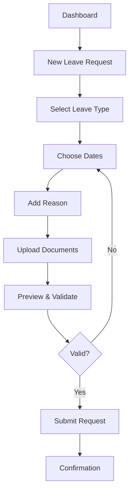
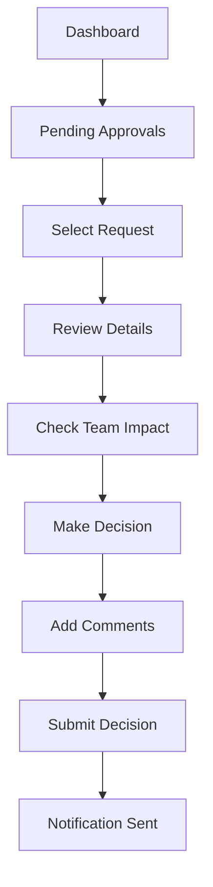

# Leave Management System - UI/UX Design Specifications

## Design Philosophy
The Leave Management System embraces a **dark-first design philosophy** with a focus on **clarity, efficiency, and user empowerment**. The interface prioritizes information density while maintaining excellent readability and accessibility standards.

## Design System

### Color Palette
```css
/* Primary Colors */
--primary: 222.2 84% 4.9%        /* Dark slate background */
--primary-foreground: 210 40% 98% /* Light text on dark */

/* Secondary Colors */
--secondary: 217.2 32.6% 17.5%   /* Slightly lighter background */
--secondary-foreground: 210 40% 98%

/* Accent Colors */
--accent: 217.2 91.2% 59.8%      /* Blue accent for actions */
--accent-foreground: 222.2 84% 4.9%

/* Status Colors */
--success: 142 76% 36%           /* Green for approved */
--warning: 38 92% 50%            /* Orange for pending */
--destructive: 0 84% 60%         /* Red for rejected */
```

### Typography Scale
```css
/* Headings */
--font-size-xs: 0.75rem;    /* 12px */
--font-size-sm: 0.875rem;   /* 14px */
--font-size-base: 1rem;     /* 16px */
--font-size-lg: 1.125rem;   /* 18px */
--font-size-xl: 1.25rem;    /* 20px */
--font-size-2xl: 1.5rem;    /* 24px */
--font-size-3xl: 1.875rem;  /* 30px */
--font-size-4xl: 2.25rem;   /* 36px */

/* Line Heights */
--leading-tight: 1.25;
--leading-snug: 1.375;
--leading-normal: 1.5;
--leading-relaxed: 1.625;
```

### Spacing System
```css
/* Based on 0.25rem (4px) increments */
--space-1: 0.25rem;   /* 4px */
--space-2: 0.5rem;    /* 8px */
--space-3: 0.75rem;   /* 12px */
--space-4: 1rem;      /* 16px */
--space-5: 1.25rem;   /* 20px */
--space-6: 1.5rem;    /* 24px */
--space-8: 2rem;      /* 32px */
--space-10: 2.5rem;   /* 40px */
--space-12: 3rem;     /* 48px */
```

## Component Architecture

### Layout Components

#### 1. Dashboard Layout (`DashboardLayout`)
**Purpose:** Main application shell with navigation and content area
**Structure:**
```
┌─────────────────────────────────────────┐
│ [Sidebar] [Main Content Area]           │
│   - Logo & Navigation                   │
│   - User Profile Menu                   │
│   - Quick Actions                       │
│                                         │
│ [Content Area]                          │
│   - Page Header with breadcrumbs        │
│   - Main content region                 │
│   - Action buttons/floating actions     │
└─────────────────────────────────────────┘
```

**Responsive Behavior:**
- **Desktop:** Sidebar + main content (sidebar collapsible)
- **Tablet:** Collapsible sidebar, full-width content
- **Mobile:** Bottom navigation, full-width content

#### 2. Page Header (`PageHeader`)
**Purpose:** Consistent page identification and actions
**Structure:**
```tsx
<PageHeader
  title="Leave Requests"
  description="Manage and track leave requests"
  actions={[
    { label: "New Request", variant: "default" },
    { label: "Export", variant: "outline" }
  ]}
/>
```

### Feature-Specific Components

#### 1. Leave Request Form (`LeaveRequestForm`)
**Purpose:** Create and edit leave requests
**Sections:**
1. **Leave Type Selection** - Dropdown with leave types
2. **Date Selection** - Date range picker with balance preview
3. **Reason Input** - Rich text area for leave justification
4. **Attachment Upload** - Drag & drop document upload
5. **Preview & Submit** - Summary and validation

**Validation States:**
- Real-time balance checking
- Date conflict detection
- Required field validation
- Business rule enforcement

#### 2. Leave Calendar (`LeaveCalendar`)
**Purpose:** Visual leave schedule management
**Features:**
- Monthly/weekly view toggle
- Team member filtering
- Leave type color coding
- Interactive leave request placement
- Conflict highlighting

#### 3. Approval Queue (`ApprovalQueue`)
**Purpose:** Manager leave approval interface
**Features:**
- Filterable request list
- Bulk approval actions
- Request detail modal
- Comment system
- Status history

#### 4. Document Manager (`DocumentManager`)
**Purpose:** Document upload and expiry tracking
**Features:**
- Drag & drop upload area
- Document type categorization
- Expiry date tracking
- Bulk operations
- Access control management

## User Flow Designs

### Employee Leave Request Flow


### Manager Approval Flow


## Responsive Design Specifications

### Breakpoint Strategy
```css
/* Mobile First Approach */
--breakpoint-sm: 640px;   /* Mobile landscape */
--breakpoint-md: 768px;   /* Tablet */
--breakpoint-lg: 1024px;  /* Desktop */
--breakpoint-xl: 1280px;  /* Large desktop */
--breakpoint-2xl: 1536px; /* Extra large */
```

### Mobile Optimizations
- **Touch Targets:** Minimum 44px for all interactive elements
- **Thumb Navigation:** Bottom navigation for primary actions
- **Swipe Gestures:** Swipe to navigate between requests
- **Simplified Forms:** Progressive disclosure for complex forms

### Tablet Optimizations
- **Hybrid Navigation:** Collapsible sidebar with bottom actions
- **Split Views:** Show list and detail simultaneously
- **Touch + Mouse:** Support both input methods

### Desktop Optimizations
- **Keyboard Shortcuts:** Full keyboard navigation support
- **Multi-Panel Layouts:** Advanced filtering and detail views
- **Drag & Drop:** Enhanced interaction patterns

## Accessibility Implementation

### WCAG 2.1 AA Compliance
- **Color Contrast:** All text meets 4.5:1 minimum ratio
- **Keyboard Navigation:** Full tab order and focus management
- **Screen Reader Support:** Comprehensive ARIA labeling
- **Motion Preferences:** Respects prefers-reduced-motion
- **High Contrast Mode:** Support for Windows high contrast

### Focus Management
```css
/* Focus Ring Styles */
.focus-visible:focus-visible {
  outline: 2px solid hsl(var(--accent));
  outline-offset: 2px;
}

/* Skip Links */
.skip-link {
  position: absolute;
  top: -40px;
  left: 6px;
  background: hsl(var(--primary));
  color: hsl(var(--primary-foreground));
  padding: 8px;
  text-decoration: none;
  z-index: 100;
}
```

## Loading States & Error Handling

### Loading Indicators
- **Skeleton Screens:** For content loading
- **Progress Bars:** For form submissions and data processing
- **Spinner Buttons:** For action buttons during processing
- **Shimmer Effects:** For list and card loading

### Error States
- **Inline Validation:** Real-time field validation
- **Toast Notifications:** Non-intrusive error messaging
- **Error Boundaries:** Graceful error recovery
- **Retry Mechanisms:** Automatic retry for transient errors

## Animation & Microinteractions

### Transition Principles
- **Purposeful Motion:** Every animation serves a functional purpose
- **Performance First:** 60fps animations using CSS transforms
- **Reduced Motion:** Respect for accessibility preferences

### Key Animations
- **Page Transitions:** Smooth route changes with slide animations
- **Modal Entrance:** Scale and fade for modal dialogs
- **List Interactions:** Stagger animations for dynamic content
- **Status Changes:** Color transitions for state changes

## Design Tokens

### Component Tokens
```typescript
export const designTokens = {
  colors: {
    primary: {
      50: '#f8fafc',
      500: '#64748b',
      900: '#0f172a',
      950: '#020617'
    }
  },
  spacing: {
    xs: '0.25rem',
    sm: '0.5rem',
    md: '1rem',
    lg: '1.5rem',
    xl: '2rem'
  },
  typography: {
    fontFamily: {
      sans: ['Inter', 'system-ui', 'sans-serif'],
      mono: ['JetBrains Mono', 'monospace']
    },
    fontSize: {
      xs: '0.75rem',
      sm: '0.875rem',
      base: '1rem',
      lg: '1.125rem'
    }
  },
  borderRadius: {
    sm: '0.125rem',
    md: '0.375rem',
    lg: '0.5rem',
    xl: '0.75rem'
  }
} as const;
```

This UI/UX design specification provides a comprehensive foundation for building an accessible, performant, and user-friendly Leave Management System with a dark-first design philosophy.
